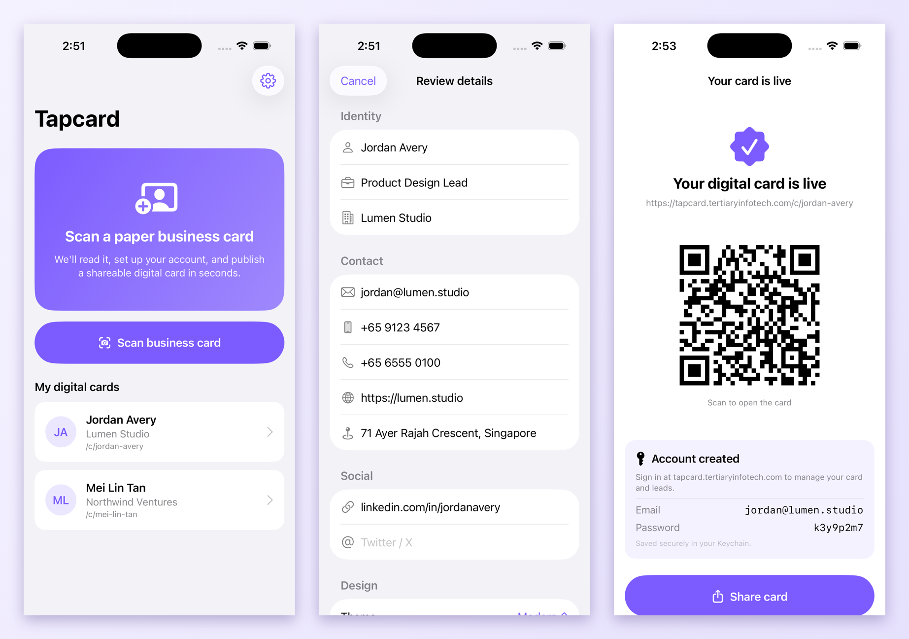
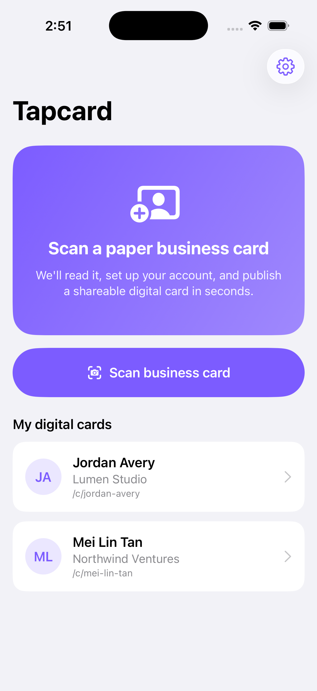
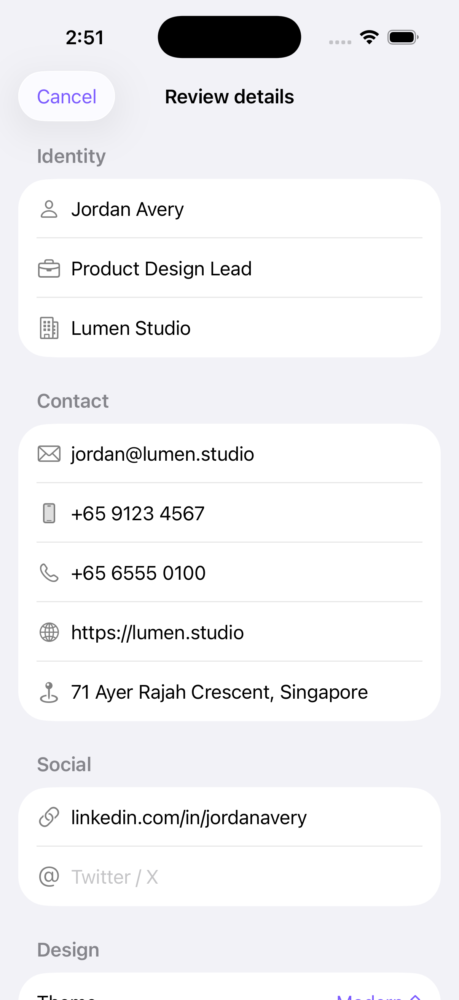
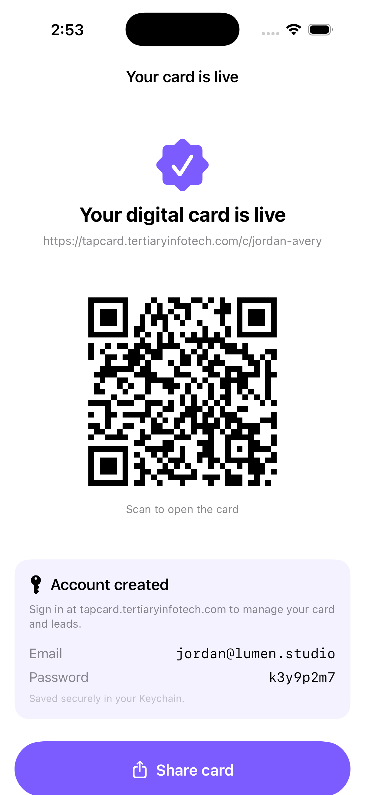

<div align="center">

# Tapcard — iOS

[](https://developer.apple.com/ios/)
[](https://swift.org)
[](https://developer.apple.com/xcode/swiftui/)
[](https://developer.apple.com/documentation/visionkit)
[](https://github.com/yonaskolb/XcodeGen)

**Scan a paper business card → get a shareable digital card in seconds.**

Point your camera at a business card. Tapcard reads it on-device with VisionKit/Vision OCR,
sets up your account, and publishes a live digital card with a QR code — backed by the
[Tapcard](https://tapcard.tertiaryinfotech.com) platform.

<a href="https://apps.apple.com/us/app/tertiary-tapcard/id6780261599">
  
</a>

</div>

---

## Screenshots



| Home | Review (OCR) | Card live |
|---|---|---|
|  |  |  |

---

## What it does

1. **Scan** — VisionKit's document camera captures and de-skews a paper business card.
2. **Read** — Vision OCR extracts the text on-device; a heuristic parser sorts it into
   name, title, company, email, phone, website, address and socials.
3. **Confirm** — you review and correct the auto-filled fields (or enter them manually).
4. **Publish** — one tap creates your account and a published digital card via the Tapcard
   backend; you get the public URL, a QR code, and login credentials saved to the Keychain.

Everything scanning/OCR is **on-device**; only the card you choose to publish is sent to
your account.

---

## Tech stack

| Category | Details |
|---|---|
| **Language / UI** | Swift 6 (strict concurrency), SwiftUI, MVVM, iOS 18+ |
| **Scanning / OCR** | VisionKit (`VNDocumentCameraViewController`), Vision (`VNRecognizeTextRequest`) |
| **State** | `@Observable` view models, `@MainActor` isolation |
| **Networking** | `URLSession` async/await → Tapcard REST API |
| **Storage** | UserDefaults (created cards) + Keychain (credentials) |
| **QR** | Core Image `CIQRCodeGenerator` |
| **Project gen** | XcodeGen (`project.yml`) |

---

## Architecture (MVVM)

```
App/          TapcardApp.swift — @main, injects AccountStore
Models/       BusinessCard (scanned/edited fields), CardTheme, PublishedCard
Services/     CardScannerService (VisionKit), OCRService (Vision), ContactParser,
              TapcardAPI (backend onboarding), KeychainStore
ViewModels/   ScanViewModel (scan→review→publish), AccountStore  (@MainActor @Observable)
Views/        Home, ScanFlow, ReviewCard, CardResult, SavedCardDetail, Settings
Utilities/    Constants (backend URL), QRGenerator (+ Color hex), DemoSupport
Resources/    Assets.xcassets (AppIcon, AccentColor), PrivacyInfo.xcprivacy
```

---

## Backend contract

The app talks to one endpoint on the [Tapcard](https://tapcard.tertiaryinfotech.com) platform
(Next.js + Prisma + PostgreSQL on Coolify):

```
POST /api/mobile/onboard
  { fullName, email, jobTitle?, company?, mobile?, officePhone?, website?, address?, … }
→ { card: { slug, url }, isNewAccount, password? }
```

It finds-or-creates the account from the card's email and publishes the digital card in a
single round-trip, persisting to the same database the Tapcard web app uses.

---

## Getting started

### Prerequisites
- Xcode 26+, iOS 18 SDK
- [XcodeGen](https://github.com/yonaskolb/XcodeGen) (`brew install xcodegen`)

### Build & run

```bash
xcodegen generate
xcodebuild -project Tapcard.xcodeproj -scheme Tapcard \
  -destination 'platform=iOS Simulator,name=iPhone 17' build CODE_SIGNING_ALLOWED=NO
```

> The simulator has no camera, so the scan flow also offers **Enter details manually**.
> XcodeGen uses an explicit file list — run `xcodegen generate` after adding any `.swift` file.

---

## Privacy

- Scanning, OCR and parsing run **on-device** with Vision — no third-party SDKs.
- Only the card you publish (your name, contact details and email) is sent to your Tapcard
  account; `PrivacyInfo.xcprivacy` declares this as app-functionality data, not tracking.

---

## Developed by

**[Tertiary Infotech Academy Pte Ltd](https://www.tertiaryinfotech.com/)**

Companion iOS client for the [Tapcard](https://tapcard.tertiaryinfotech.com) digital
business-card + CRM platform.

[Download Tapcard on the App Store](https://apps.apple.com/us/app/tertiary-tapcard/id6780261599)
